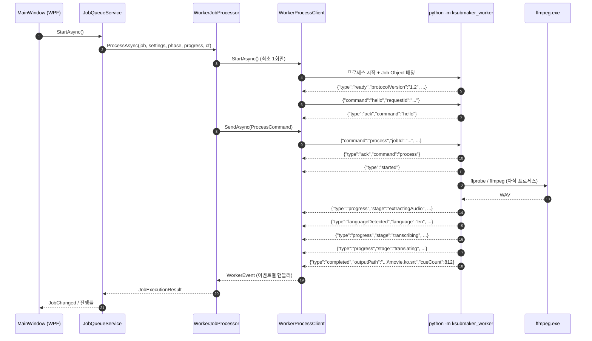

# KSubMaker 아키텍처

이 문서는 저장소에 실제로 구현되어 있는 구조만 설명합니다. 아직 구현되지 않은 부분은
마지막 "현재 구현되지 않은 것" 절에 따로 적었습니다.

---

## 1. 한눈에 보기

KSubMaker는 **두 개의 프로세스**로 이루어진 Windows 데스크톱 애플리케이션입니다.

* **호스트** — .NET 10 / WPF 애플리케이션. 폴더 스캔, 작업 큐, 데이터베이스, 설정, 모델
  다운로드, UI를 담당합니다.
* **AI 워커** — Python 프로세스(`python -m ksubmaker_worker`). FFmpeg 호출, faster-whisper
  음성 인식, 번역, SRT 저장을 담당합니다.

두 프로세스는 **stdio 위의 JSON Lines** 한 줄짜리 메시지로만 대화합니다. 소켓도, 임시 파일도,
공유 메모리도 없습니다. 전체 계약은 [`WORKER_PROTOCOL.md`](WORKER_PROTOCOL.md)에 있습니다.

```
┌──────────────────────────────── KSubMaker.App.exe (.NET 10 / WPF) ────────────────────────────────┐
│                                                                                                   │
│  MainWindow / SettingsWindow / ModelsWindow / LogWindow   (WPF, CommunityToolkit.Mvvm)            │
│        │                                                                                          │
│  JobQueueService ── VideoScanService ── SettingsService ── HardwareService                        │
│        │                                                                                          │
│  IJobProcessorSelector ─┬─ WorkerJobProcessor  (실제 파이프라인)                                   │
│                         └─ InProcessJobProcessor (Fake AI 모드)                                   │
│        │                                                                                          │
│  WorkerProcessClient ──── Windows Job Object (KILL_ON_JOB_CLOSE)                                  │
│        │                                                                                          │
│  SQLite (EF Core)   %LOCALAPPDATA%\KSubMaker\database\ksubmaker.db                               │
│  Serilog 파일 로그  %LOCALAPPDATA%\KSubMaker\logs\ksubmaker-YYYYMMDD.log                          │
└───────┬───────────────────────────────────────────────────────────────────────────────────────────┘
        │  stdin  : {"command":"process", ...}\n      (JSON 한 줄 = 명령 하나)
        │  stdout : {"type":"progress", ...}\n        (JSON 한 줄 = 이벤트 하나)
        │  stderr : 사람이 읽는 로그 (프로토콜 아님)
        ▼
┌──────────────────────────────── python -m ksubmaker_worker ───────────────────────────────────────┐
│                                                                                                   │
│  main.Worker  ── 메인 스레드에서 stdin 읽기 / 작업은 백그라운드 스레드 1개                          │
│  commands.CommandHandlers ── 파이프라인 오케스트레이션 + CUDA OOM 사다리                           │
│        │                                                                                          │
│  ffmpeg_service ─▶ ffmpeg.exe / ffprobe.exe   (또 다른 자식 프로세스)                              │
│  transcriber   ─▶ faster-whisper (CTranslate2)                                                    │
│  translator    ─▶ CTranslate2 + NLLB-200      (기본)                                              │
│  llm_translator ▶ llama-server (127.0.0.1, 임시 포트, OpenAI 호환 HTTP)  (선택)                    │
│  checkpoint    ─▶ cache/{jobId}/*.json                                                            │
│  subtitle_writer ▶ *.ko.srt  (UTF-8 BOM + CRLF, temp → os.replace)                                │
└───────────────────────────────────────────────────────────────────────────────────────────────────┘
```

---

## 2. 계층 구조와 의존 방향

솔루션은 6개의 C# 프로젝트로 나뉩니다. 화살표는 "참조한다"는 뜻이며, **반대 방향 참조는
허용되지 않습니다.**

```
KSubMaker.Domain ◀── KSubMaker.Application ◀── KSubMaker.Infrastructure ◀┐
        ▲                    ▲                                           │
        │                    │                                           │
KSubMaker.WorkerProtocol ────┘                    KSubMaker.Worker ──────┤
                                                          ▲              │
                                                          └─── KSubMaker.App
```

| 프로젝트 | TFM | 역할 | 참조 |
| --- | --- | --- | --- |
| `KSubMaker.Domain` | `net10.0` | 순수 도메인. 작업 상태 기계, 진행률 계산, 하드웨어 권장 정책, 모델 카탈로그, 자막 후처리·줄바꿈·SRT 직렬화, 오류 코드. NuGet 의존성 **0개**. | 없음 |
| `KSubMaker.WorkerProtocol` | `net10.0` | 워커와 주고받는 명령·이벤트 레코드와 JSON Lines 코덱. **와이어 계약의 유일한 정본.** | 없음 |
| `KSubMaker.Application` | `net10.0` | 추상화(`IJobProcessor`, `IModelManager`, `IWorkerClient`, `IAppPaths` …)와 오케스트레이션 서비스(작업 큐, 스캔, 설정, 하드웨어). 인프라 구현체를 모릅니다. | Domain, WorkerProtocol |
| `KSubMaker.Infrastructure` | `net10.0` | EF Core + SQLite, 경로, 파일 시스템, FFmpeg/FFprobe 실행, nvidia-smi 하드웨어 감지, HTTPS 모델 다운로더, Serilog, 원자적 SRT 쓰기, 체크포인트 파일 저장소. | Domain, Application, WorkerProtocol |
| `KSubMaker.Worker` | `net10.0` | Python 프로세스 감독: 실행 파일 탐색(`ToolLocator`), 프로세스 수명(`WorkerProcessClient`), Windows Job Object, 프로토콜 이벤트를 작업 진행률로 변환(`WorkerJobProcessor`). | Domain, Application, WorkerProtocol |
| `KSubMaker.App` | `net10.0-windows` (WPF) | 화면 4개, ViewModel, DI 합성 루트, 단일 인스턴스 뮤텍스, 전역 예외 처리. | 위 전부 |

### 왜 이렇게 나눴는가

`Infrastructure`와 `Worker`는 **일부러 `net10.0-windows`가 아니라 `net10.0`** 입니다. 레지스트리
접근, `GlobalMemoryStatusEx`, Job Object interop은 전부 `OperatingSystem.IsWindows()` 가드 안에
있습니다. 덕분에 Windows 전용 코드가 들어 있는 어셈블리도 Linux CI에서 컴파일·테스트할 수 있고,
WPF 셸(`KSubMaker.App`)만 `net10.0-windows`로 남습니다. 그 하나조차
`Directory.Build.props`의 `EnableWindowsTargeting=true` 덕분에 Linux에서 restore/build까지는
됩니다(실행만 Windows 필요).

`WorkerProtocol`이 `Domain`과 분리된 이유는 방향성 때문입니다. 프로토콜은 `Domain`을 참조하지
않고, `Domain`도 프로토콜을 참조하지 않습니다. 두 쪽 모두 독립적으로 변할 수 있고, 둘을 잇는
매핑은 `WorkerJobProcessor.BuildCommand` 한 곳에만 있습니다. 그래서 "와이어 형식을 바꾸면
도메인이 깨진다"는 일이 생기지 않습니다.

---

## 3. 데이터 흐름

```
영상 → FFmpeg → WAV(16kHz mono PCM) → faster-whisper → 세그먼트 JSON → 번역 → 후처리 → ko.srt
```

실제 코드에서 각 화살표가 무엇인지:

| 단계 | 구현 | 산출물 |
| --- | --- | --- |
| 영상 → 메타데이터 | `ffprobe -show_streams -show_format -print_format json` (`ffmpeg_service.probe`) | 재생 시간, 오디오/자막 트랙 목록 |
| 영상 → WAV | `ffmpeg -vn [-map 0:a:N] -ac 1 -ar 16000 -c:a pcm_s16le -f wav` (`ffmpeg_service.extract_audio`) | `cache/{jobId}/audio.wav` |
| WAV → 세그먼트 | `faster_whisper.WhisperModel.transcribe(...)` (`transcriber.py`) | `{id, start, end, text, words[]}` 목록 |
| 세그먼트 분할 | `subtitle_postprocessor.split_segments` — 단어 타임스탬프가 **아직 살아 있을 때** 90자/최대 길이 기준으로 자릅니다 | 짧아진 세그먼트, id 재부여 |
| 세그먼트 → 배치 | `batching.split_batches` — 30항목 / 2500자 / 미디어 180초 중 먼저 걸리는 조건에서 배치를 닫습니다 | `Batch` 목록 + 앞 배치 꼬리 3줄(문맥용) |
| 배치 → 한국어 | `translator.NllbTranslator` 또는 `llm_translator.LlmTranslator` | `{id: 한국어}` |
| 검증 | `batching.validate` — 누락/중복/미지의 id/빈 문자열을 잡아내고 **빠진 id만** 최대 3회 재요청 | 완전한 `{id: 한국어}` |
| 후처리 | `subtitle_postprocessor.build_cues` + `KoreanLineBreaker` | 줄바꿈·병합·최소 간격이 적용된 큐 |
| 큐 → 파일 | `subtitle_writer.write_subtitle_file` | `*.ko.srt` (UTF-8 BOM, CRLF) |

### "번역은 절대 타임코드를 움직이지 않는다"

이것이 파이프라인 전체를 지배하는 불변식입니다.

번역 엔진에 넘어가는 자료형은 `SubtitleItem(int Id, string Text)`이고 돌아오는 자료형은
`TranslatedSubtitleItem(int Id, string Translation)`입니다. **둘 다 시간 정보를 담지 않습니다.**
시작·종료 시각은 세그먼트 쪽에만 남아 있고, 번역 결과는 `id`로 되붙습니다
(`build_cues`, `SubtitleCue`).

그래서 다음이 보장됩니다.

1. 번역 모델이 아무리 이상한 답을 해도 자막의 싱크는 바뀔 수 없습니다. 최악의 경우 텍스트가
   틀리거나 배치가 거부될 뿐입니다.
2. 길이 조정이 필요하면 **번역 전에** 합니다(`split_segments`). Whisper의 단어 타임스탬프가
   살아 있는 시점이라 잘린 조각도 실제 음성에서 유도된 시각을 갖습니다. 한국어가 된 뒤에
   자르면 시간은 보간할 수밖에 없습니다.
3. `TranslationValidator` / `batching.validate`가 id 집합의 동일성을 강제합니다. 번역기가
   항목을 합치거나 빠뜨리면 조용히 받아들이는 대신 **빠진 id만** 다시 요청합니다. 자막이 소리
   없이 사라지는 것이 이 프로그램에서 가장 나쁜 실패이기 때문입니다.
4. 애초에 번역할 것이 없는 큐는 엔진까지 가지 않습니다. `TranslatableText.HasTranslatableContent`
   / `batching.has_translatable_content`가 "어떤 문자 체계로든 글자나 십진 숫자가 하나라도 있는가"를
   묻고, 아니면(`♪`, `～`, `…`, `。`, `！？`, `＊`, 빈 괄호 …) 원문을 그대로 통과시킵니다. id와
   시간은 유지되므로 자막에는 그대로 남습니다. ASCII 기준으로 검사하면 일본어·한국어·키릴 문자가
   전부 "번역할 것 없음"이 되므로 유니코드 카테고리로 판단합니다.
5. 재시도를 다 쓰고도 남은 빈 번역은 **작업을 실패시키지 않고 원문을 그대로 씁니다.**
   `INVALID_TRANSLATION_RESPONSE`는 진짜 프로토콜 손상 — 요청하지 않은 id, 중복 id, 해석 불가능한
   응답, 또는 배치의 절반 이상이 비어 돌아온 경우 — 에만 씁니다. 자세한 근거는
   [`TROUBLESHOOTING.md §13`](TROUBLESHOOTING.md#13-invalid_translation_response--번역-결과-형식-오류).
   두 구현의 임계값은 `tests/fixtures/translation/untranslatable-segments.json` 한 파일을 C#과
   파이썬이 함께 읽어서 고정합니다(`TranslatableTextParityTests`, `test_translatable_parity.py`).

---

## 4. 프로세스 경계 (시퀀스)



프로세스 트리 정리는 **두 겹**입니다.

1. `WindowsJobObject` — `JOB_OBJECT_LIMIT_KILL_ON_JOB_CLOSE`. 워커를 시작한 직후 배정하며,
   호스트가 작업 관리자에서 강제 종료되어도 커널이 Python과 그 자식(FFmpeg, llama-server)을
   같이 죽입니다. 관리 코드가 한 줄도 실행되지 않는 상황을 이것 하나가 담당합니다.
2. `ProcessTree.KillTree(process, entireProcessTree: true)` — 정상 종료 경로. `shutdown` 명령을
   먼저 보내고, `WorkerOptions.ShutdownTimeout`(기본 10초) 안에 끝나지 않으면 트리를 죽입니다.

---

## 5. 기술 선택과 이유

### 5.1 왜 인프로세스 ML이 아니라 별도 Python 프로세스인가

| 이유 | 설명 |
| --- | --- |
| 생태계 | faster-whisper·CTranslate2·transformers·sentencepiece는 Python 라이브러리입니다. .NET 바인딩은 존재하더라도 상류 저장소보다 항상 늦고, CUDA/cuDNN 버전 조합에서 검증된 조합이 좁습니다. |
| 격리 | 딥러닝 스택은 네이티브 크래시(CUDA 드라이버 오류, cuDNN 심볼 불일치, OOM 시 abort)를 냅니다. 인프로세스였다면 그것이 곧 UI 크래시입니다. 별도 프로세스라면 `WORKER_CRASHED` 이벤트 하나로 끝나고 큐는 다음 파일로 넘어갑니다. |
| 메모리 회수 | CUDA 컨텍스트는 프로세스 단위로 정리됩니다. 모델을 언로드해도 남는 단편화가 있는데, 워커를 재시작하면 확실히 0이 됩니다. |
| stdout 오염 | 모델 로더들은 진행 막대와 경고를 마음대로 출력합니다. 별도 프로세스라면 `protocol.install_stdout_guard()`로 그 출력을 stderr로 밀어낼 수 있습니다(§5.2). |
| 배포 | 임베디드 CPython(python-build-standalone)을 `tools/python`에 통째로 넣으면 사용자는 Python을 설치할 필요가 없고, .NET 쪽은 self-contained 게시로 런타임 설치가 필요 없습니다. |

대가는 IPC 비용인데, 이 워크로드에서는 무시할 수 있습니다. 2시간짜리 영상 한 편에 오가는
프로토콜 메시지는 수천 건이고, 실제 연산은 분 단위입니다.

### 5.2 왜 stdio 위의 JSON Lines인가

* **한 줄 = 한 메시지**라는 프레이밍은 양쪽 표준 라이브러리만으로 구현됩니다. Python은
  `for line in sys.stdin`, .NET은 `StreamReader.ReadLineAsync()`. 길이 접두사도, 프레이밍
  버그도 없습니다.
* **stdout은 프로토콜 전용, stderr는 로그**로 완전히 갈라집니다.
  `protocol.install_stdout_guard()`가 진짜 stdout을 붙잡아 두고 `sys.stdout`을 stderr로
  바꿔치기하므로, 모델 로더 안의 `print` 한 줄이 채널을 깨뜨리는 대신 로그를 더럽힙니다.
* **포트도, 권한도 필요 없습니다.** 로컬 소켓이었다면 방화벽 프롬프트, 포트 충돌, 다중 인스턴스
  문제를 전부 다뤄야 합니다.
* **한 줄이 깨져도 치명적이지 않습니다.** `WorkerProtocolSerializer.DeserializeEvent`는 절대
  예외를 던지지 않고 `UnknownEvent`를 돌려주며, 호스트는 경고 로그만 남기고 계속 읽습니다.
  워커 쪽도 대칭적으로 `Worker._parse`가 잘못된 입력 줄을 무시합니다.
* **정본이 하나입니다.** `src/KSubMaker.WorkerProtocol/*.cs`가 계약이고,
  `worker/ksubmaker_worker/protocol.py`가 그 거울입니다. 필드명은 camelCase로 통일되어 있습니다.

`[JsonPolymorphic]` 대신 손으로 짠 판별자 디스패치를 쓴 이유는 ADR-007에 있습니다.

### 5.3 왜 기본 번역 엔진이 CTranslate2 + NLLB-200인가

`AppSettings.TranslationEngine`의 기본값은 `TranslationEngineKind.LocalTranslationModel`이고,
그 구현은 `worker/ksubmaker_worker/translator.py`의 `NllbTranslator`입니다.

| 근거 | 내용 |
| --- | --- |
| **이미 의존성에 있다** | faster-whisper가 CTranslate2 위에서 돌아갑니다. 번역에 같은 런타임을 쓰면 새 추론 프레임워크(torch, ONNX Runtime, llama.cpp)를 하나도 추가하지 않습니다. 배포 크기도, 검증할 CUDA 조합도 늘지 않습니다. |
| **GPU 가속이 그대로 따라온다** | Whisper를 GPU로 돌릴 수 있는 기계라면 NLLB도 GPU로 돌아갑니다. 별도 설정이 없습니다. `device`/`compute_type` 인자도 Whisper와 같은 이름을 씁니다. |
| **VRAM이 작다** | `nllb-200-distilled-600M`은 `int8_float16`에서 약 1.0GB(모델 카탈로그 값). Whisper large-v3(float16 5.5GB)와 같이 올려도 8GB 카드에 들어갑니다. 이것이 처리 방식 A(파일 단위 순차)를 쓸 수 있느냐를 가릅니다. |
| **결정적이다** | 빔 서치 기계번역은 같은 입력에 같은 출력을 냅니다. 같은 영상을 두 번 돌리면 같은 자막이 나옵니다. 샘플링하는 LLM은 그렇지 않습니다. |
| **문장 단위라서 id가 흔들릴 수 없다** | 이것이 결정적인 이유입니다. NLLB는 **큐 하나를 독립된 시퀀스 하나로** 번역합니다(`translate_batch`에 여러 시퀀스를 한꺼번에 넘길 뿐, 절대 이어붙이지 않습니다). 입력 시퀀스 N개 → 출력 시퀀스 N개가 라이브러리 수준에서 보장되므로, "모델이 두 줄을 합쳐 버려서 자막 하나가 사라졌다"는 사고 자체가 구조적으로 불가능합니다. LLM 경로에서는 같은 보장을 얻기 위해 JSON 배열 파싱 + id 검증 + 재시도를 얹어야 합니다. |

한계도 분명합니다. NLLB는 프롬프트를 이해하지 못하므로 `translationStyle`을 진짜로 따르지
못합니다. `polite`/`casual`은 번역이 끝난 뒤 문장 어미를 정규화하는 방식으로 근사할 뿐이고,
그 사실은 `translator.py`의 `apply_style` 바로 옆에 적혀 있습니다. 문체 제어가 중요하면
로컬 LLM 엔진을 쓰라는 것이 설계된 답입니다.

라이선스도 반드시 짚어야 합니다. **NLLB-200 가중치는 CC-BY-NC-4.0(비상업적 전용)** 입니다.
자세한 내용은 [`THIRD_PARTY_NOTICES.md`](../THIRD_PARTY_NOTICES.md)를 보세요.

### 5.4 왜 로컬 LLM은 Ollama가 아니라 llama.cpp `llama-server`인가

로컬 LLM 옵션(`TranslationEngineKind.LocalLlm`)은 `worker/ksubmaker_worker/llm_translator.py`에
구현되어 있고, 워커가 **직접** `llama-server`를 자식 프로세스로 띄운 뒤
`http://127.0.0.1:<임시포트>/v1/chat/completions`로 이야기합니다.

Ollama를 쓰지 않은 이유:

| 항목 | llama.cpp `llama-server` | Ollama |
| --- | --- | --- |
| 재배포 | MIT 라이선스 바이너리를 그대로 `tools/llama/`에 넣어 함께 배포할 수 있습니다. | 별도 설치 프로그램을 사용자가 따로 깔아야 합니다. 설치 여부를 우리가 통제할 수 없습니다. |
| 백그라운드 서비스 | 없습니다. 작업이 시작될 때 뜨고, 끝나면 `stop()`으로 죽습니다. Job Object에도 묶여 있어 호스트가 죽으면 같이 죽습니다. | 상주 서비스가 부팅 때부터 떠 있고 VRAM/포트를 계속 잡습니다. 자막 프로그램 하나 때문에 상시 데몬이 생기는 것은 과합니다. |
| 포트 | 프로세스마다 OS에서 받은 임시 포트에 127.0.0.1로만 바인딩합니다. 인스턴스가 여러 개여도 충돌하지 않습니다. | 고정 포트(11434) 하나를 전역으로 씁니다. |
| 모델 형식 | GGUF 양자화를 직접 씁니다. Qwen2.5 7B Q4_K_M이 약 4.6GB로, 소비자용 카드에서 실용적입니다. | 자체 모델 저장소·태그 체계를 강제하므로, 우리 모델 카탈로그(§`ModelCatalog`)와 이중 관리가 됩니다. |
| API | OpenAI 호환 `/v1/chat/completions`. 요청/응답 형태가 표준이라 코드가 단순합니다. `/health`로 준비 상태를 확인합니다. | 자체 API. 호환 엔드포인트가 있지만 한 겹 더 얹힌 계층입니다. |
| 오프라인 | 모델 파일만 있으면 네트워크가 전혀 필요 없습니다. | 모델 pull이 Ollama 레지스트리를 통합니다. |

VRAM에 따라 GPU에 올릴 레이어 수는 `choose_gpu_layers`가 결정합니다(3GB 미만이면 아예 CPU —
일부만 올려 스필이 나면 안 올린 것보다 느리기 때문입니다).

`llama-server`는 **기본 배포에 포함되지 않습니다.** 받는 방법은
[`MODEL_MANAGEMENT.md`](MODEL_MANAGEMENT.md)와 `scripts/fetch-llama.ps1`에 있습니다.

---

## 6. 처리 방식 A / B / C

`ProcessingStrategy`(도메인 열거형) → `JobQueueService.PumpAsync`가 분기합니다. 설정이
`Auto`(기본)이면 `HardwareRecommendationPolicy.Recommend`가 감지된 하드웨어로부터 고릅니다.

| 방식 | 열거형 | 동작 | 선택 조건 |
| --- | --- | --- | --- |
| **A. 파일 단위 순차** | `SequentialPerFile` | 파일마다 추출 → 인식 → 번역 → 저장을 끝내고 다음 파일로. 워커에는 `phase="full"` 한 번. | GPU + CUDA가 있고, `Whisper VRAM + 번역 VRAM + 1.0GB 여유` ≤ 전체 VRAM 일 때. 첫 파일의 자막이 가장 빨리 나오는 방식입니다. |
| **B. 전체 인식 후 전체 번역** | `TranscribeAllThenTranslate` | 큐 전체를 `phase="transcribe"`로 한 바퀴(Whisper만 상주) → 그다음 전체를 `phase="translate"`로 한 바퀴(Whisper 언로드 후 번역 모델 로드). | 두 모델이 동시에 안 들어갈 때. GPU가 없거나 CUDA를 못 쓸 때도 이 방식입니다. 모델 교체 횟수를 파일 수 × 2에서 2로 줄입니다. |
| **C. 파이프라인 병렬** | `PipelinedParallel` | 파일 N+1의 인식과 파일 N의 번역을 겹칩니다. 번역끼리는 직렬입니다. | VRAM 16GB 이상 **그리고** `Whisper VRAM + 번역 VRAM + 2.5GB` ≤ 전체 VRAM 일 때만. |

방식 B와 C가 가능한 이유는 `JobPhase`가 파이프라인을 쪼갤 수 있게 만들어졌기 때문입니다.
`transcribe` 단계는 ASR 결과를 `transcription.json`에 체크포인트하고 멈추고, `translate`
단계는 그 체크포인트에서 이어받습니다. 큐 서비스는 모델이 메모리에 있는지 없는지를 전혀 알
필요가 없습니다.

CPU 전용 환경에서는 언제나 방식 B이며, `HardwareRecommendation.Rationale`이 설정 화면에
"CPU 모드로 동작하며, 영상 길이 대비 5~15배의 처리 시간이 걸릴 수 있습니다."라고 알려 줍니다.

### 6.1 음성 미리 추출 레인 (방식 A/B/C와 직교)

`JobQueueService.RunAudioPrefetchAsync`가 펌프와 **나란히** 돌면서, 앞으로 처리할 파일의 음성을
미리 뽑아 둡니다. 네 번째 처리 방식이 아니라 세 방식 **모두에 얹히는** 레인입니다.

방식 C와 혼동하기 쉬운데 겹치는 대상이 다릅니다. C는 파일 N+1의 **인식**과 파일 N의 **번역**을
겹치므로 두 모델이 동시에 VRAM에 있어야 하고, 그래서 16GB 이상에서만 선택됩니다. 이 레인이
겹치는 것은 **음성 추출**이고, 그건 ffmpeg — CPU와 디스크만 씁니다. **VRAM을 0 사용**하므로 C가
제공되지 않는 하드웨어에서도, CPU 전용 환경에서도 그대로 동작합니다.

인계 방식에 별도 장치가 없다는 점이 설계의 핵심입니다. 워커의 `extractAudio`는 작업이 스스로
썼을 `audio.wav`와 체크포인트 기록을 **그대로** 남깁니다. 그래서 "미리 뽑은 음성을 쓰라"는
명령이 필요 없고, 뒤따르는 작업은 추출 단계가 이미 끝나 있는 것을 발견해 건너뜁니다. 미리
추출이 실패하거나 아예 일어나지 않아도 손해는 아꼈을 시간뿐입니다.

**선행 깊이는 왜 제한하는가.** 전체 시간은 추출이 소비자보다 앞서기만 하면
`extract₁ + Σ(인식 + 번역)`으로 수렴합니다. 추출(2시간 영상에 30~90초)이 인식·번역보다 훨씬
빠르므로 **깊이 1이면 이미 그 조건을 만족**하고, 더 앞서가도 처리량은 같습니다. 반면 비용은
실제로 듭니다 — 16kHz 모노 wav가 영상 1시간당 약 115MB이므로, 2시간짜리 147개를 전부 미리
뽑으면 약 34GB가 큐가 도달하기를 기다리며 디스크에 쌓입니다. 기본값 1, 상한 32이며 0이면
끕니다. 올릴 이유는 원본이 느린 디스크나 네트워크 드라이브에 있어 추출이 따라오지 못할 때뿐입니다.

**경합.** 호스트가 파일 N을 시작했는데 파일 N의 미리 추출이 아직 안 끝났을 수 있습니다. 그때
둘 다 같은 `audio.wav.tmp`에 ffmpeg를 걸면 찢어진 wav가 남고, Whisper는 그걸 오류가 아니라
**빈 전사 결과**로 만듭니다. 워커가 체크포인트 디렉터리별 잠금으로 막으며, 나중에 들어온 쪽은
먼저 끝난 wav를 재사용합니다. 큐 쪽에서도 실행 중인 작업은 미리 추출 대상에서 뺍니다.

큐가 참조하는 목록이 `PendingSnapshot()`이 **아니라** `UnfinishedInQueueOrder()`인 것도 이
경합 때문입니다. 전자는 "실행 가능"으로 걸러내는데 펌프가 선두 작업을 집는 순간 그 작업이
목록에서 빠지고, 그러면 인덱스 0이 *아직 아무도 시작하지 않은* 파일이 되어 레인이 그 파일을
영영 건너뜁니다. 종료되지 않은 작업을 전부 세면 펌프가 어디까지 갔든 선두는 인덱스 0에
머뭅니다.

### 6.2 절전 방지와 큐 완료 후 동작 (ADR-031)

`MainViewModel`이 `JobQueueService`의 상태 전이를 구독해 두 가지를 합니다.

- **실행 중 절전 방지.** 큐가 `Running`이면 `ISystemPowerService.PreventSleep()`
  (`SetThreadExecutionState`), `Idle`/`Paused`로 돌아오면 해제. 디스플레이는 그대로 꺼지게 둡니다.
- **큐 완료 후 동작.** 큐가 **스스로** 다 처리되면(`QueueDrained` 이벤트) 설정된
  절전 / 최대 절전 / 시스템 종료를 실행합니다. 30초 취소 카운트다운(`PostQueueActionWindow`)이
  항상 앞에 옵니다.

`QueueDrained`는 펌프가 실행 토큰 취소 없이, 일시정지 요청 없이 전략 메서드를 끝냈을 때만
발생합니다 — 즉 직접 누른 중단·일시정지 뒤에는 오지 않습니다. 이벤트 인자에 이번 실행의
완료·실패·취소 개수가 실립니다. "실행할지 말지"의 규칙은 `PostQueueActionPolicy`(Domain, 순수)에
있고 App은 카운트다운 창과 P/Invoke만 담당합니다 — §8.1의 지문 판단이나 §6.11의 모델 판단과
같은 이유로, App은 `net10.0-windows`라 Linux 테스트에서 못 닿습니다.

---

## 7. CUDA 메모리 부족 사다리

`commands.CommandHandlers._with_oom_recovery`가 음성 인식과 번역 양쪽을 같은 방식으로 감쌉니다.
CUDA OOM은 텍스트 매칭으로 판별합니다(`transcriber.is_cuda_oom`) — CTranslate2가 평범한
`RuntimeError`만 던지기 때문입니다.

```
run(compute)  ─ CUDA OOM ─▶ ① 모델 언로드 + gc.collect() + torch.cuda.empty_cache()
                            ② 배치를 절반으로 분할   (버리는 게 아니라 두 조각으로 나눔)
                            ③ 정밀도 강등 float32/bfloat16 → float16 → int8_float16 → int8
                            ④ "더 작은 모델을 고르세요" 로그 이벤트
                            ⑤ 딱 한 번 재시도
                                  └─ 또 OOM ─▶ CUDA_OUT_OF_MEMORY (recoverable: true)
```

세 가지가 중요합니다.

* **②는 분할이지 잘라내기가 아닙니다.** `split_batch_in_half`가 배치를 두 개로 나누고 두 개
  모두 번역합니다. 뒤쪽을 버리면 자막이 조용히 사라집니다.
* **⑤는 한 번뿐입니다.** 두 번 OOM이 난 기계는 세 번째 동일 시도에서도 성공하지 않습니다.
  사용자를 기다리게 하는 대신 실패시키고, 무엇을 바꾸면 되는지 한국어로 알려 줍니다.
* 호스트 쪽에도 대칭 사다리가 있습니다. `HardwareRecommendationPolicy.Downgrade`(정밀도)와
  `DowngradeWhisper`(large-v3 → turbo → medium → small → base)는 순수 함수라 단위 테스트가
  가능하며, 권장값을 낮출 때 쓰입니다.

`ErrorCodes.IsAutoRetryable`은 `CUDA_OUT_OF_MEMORY`, `WORKER_CRASHED`, `FFMPEG_FAILED`,
`INVALID_TRANSLATION_RESPONSE`를 자동 재시도 대상으로 봅니다. Python 쪽 `errors.RECOVERABLE`이
같은 집합을 그대로 갖고 있습니다.

---

## 8. 체크포인트와 이어하기

작업마다 `%LOCALAPPDATA%\KSubMaker\cache\{jobId}\` 아래에 파일 네 개가 생깁니다. 전부
`X.tmp`에 쓰고 `os.replace`(C#은 `File.Move(overwrite)`)로 갈아치우므로, 정전이 나면 **이전의
온전한 파일 아니면 새 온전한 파일**이지 잘린 파일은 없습니다.

| 파일 | 내용 |
| --- | --- |
| `job.json` | 마지막으로 끝난 단계, 원본 파일 크기·수정 시각 지문, 오디오 경로, **산출물별 설정 지문** |
| `transcription.json` | ASR 결과 전체 (가장 비싼 산출물) |
| `translation.partial.json` | `{세그먼트 id: 한국어}` — 배치 3개마다, 그리고 마지막에 저장 |
| `finalization.json` | 실제로 무엇을 어디에 썼는지 |
| `audio.wav` | 추출된 16kHz 모노 PCM |

이어하기 규칙:

* `audio.wav`가 있고 `completedStage`가 `extractingAudio` 이상이면 **음성 추출을 건너뜁니다.**
* `transcription.json`이 있으면 **음성 인식을 건너뜁니다.**
* `translation.partial.json`이 있으면 **빠진 id만** 번역합니다(`checkpoint.missing_ids`).
* 원본 파일의 크기나 수정 시각이 달라졌으면 **전부 무효화**합니다(`audio.wav` 포함). 같은
  이름으로 재인코딩된 영상은 타임코드가 완전히 다르기 때문입니다.
* `resume=false`로 오면 무조건 처음부터 합니다. 호스트는 항상 `resume=true`를 보냅니다 —
  방식 B/C의 두 번째 패스가 첫 패스의 체크포인트에 의존하기 때문입니다.

### 8.1 설정 지문 — 산출물별 무효화

`job.json`은 각 산출물이 **어떤 설정으로 만들어졌는지**를 함께 기록하고, 이어할 때 지금 설정과
비교해 **바뀐 것 아래로만** 버립니다(`checkpoint.stale_artifacts`).

| 지문 | 무엇에 영향 | 바뀌면 버리는 것 |
| --- | --- | --- |
| `audioSettings` | `sourceMode`, `audioTrackIndex` | 오디오 → 인식 → 번역 (전부) |
| `transcriptionSettings` | `whisperModel`, `language`, `beamSize`, `vadFilter`, `wordTimestamps`, `conditionOnPreviousText`, 자막 트랙 | 인식 → 번역 |
| `translationSettings` | `engine`, 해석된 `model`, `style`, `glossary` | 번역만 |

이 계층 구조가 핵심입니다. 번역 모델이나 문체를 바꾸고 재시도하면 **번역만** 다시 하고 한 시간
걸린 음성 인식은 그대로 씁니다. 반대로 하나의 "설정 바뀜" 플래그로 뭉뚱그리면 둘 중 하나는
반드시 틀립니다 — 번역 엔진을 바꿨는데 절반은 예전 엔진 결과인 파일이 나오거나, 오타 하나
고쳤다고 ASR을 다시 돌리거나.

설계상 주의점 두 가지:

* **성능 손잡이는 지문에 넣지 않습니다.** `batchMaxItems`·`contextLines` 같은 것으로 캐시를
  버리면 체크포인트가 쓸모없어집니다. `computeType`·`device`는 더 나쁩니다 — CUDA OOM 사다리가
  실행 중에 `computeType`을 바꾸므로, 지문에 넣으면 다운그레이드 후 모든 이어하기가 "설정
  바뀜"으로 보여 방금 끝낸 ASR을 다시 돕니다.
* **버릴 산출물을 지운 직후 지문을 새로 씁니다**(`refresh_settings`). 작업이 끝날 때까지
  미루면, 새 설정으로 돌리다 중간에 실패한 다음 재시도가 **또** "설정 바뀜"으로 판정해 매번
  0에서 다시 시작합니다. 가드: `test_a_failure_after_a_settings_change_resumes_rather_than_restarting`.

지문이 **없는** 기록(옛 빌드가 쓴 것)은 "일치"로 봅니다. 원본 파일 지문이 없을 때와 같은
판단이고 이유도 같습니다 — 옛 체크포인트라는 사실이 무언가 바뀌었다는 증거는 아니며, 그 의심만
으로 한 시간짜리 ASR을 다시 하는 쪽이 더 큰 손해입니다.

C# 쪽에도 대응 구현(`FileCheckpointStore`)이 있습니다. 이것은 Fake AI 모드/인프로세스
파이프라인이 쓰고, 워커가 쓰는 것은 Python 쪽 `CheckpointStore`입니다. 두 구현이 같은 디렉터리
규약(`cache/{jobId}`)과 같은 파일 이름을 씁니다.

> **미구현**: 설정 지문은 아직 **Python 워커에만** 있습니다. C# `InProcessJobProcessor`는 원본
> 파일 지문만 보고, 설정 변경은 감지하지 않습니다. 양쪽 다 안전하게 퇴화하므로 깨지지는
> 않습니다 — C#은 모르는 JSON 필드를 무시하고, Python은 없는 지문을 "일치"로 보므로 최악의
> 결과가 불필요한 재번역 한 번입니다. 다만 Fake AI 모드에서는 설정을 바꿔도 옛 번역이 남습니다.

---

## 9. 상태 기계

`JobStateMachine`이 유일한 전이 표를 갖습니다. `Job.TransitionTo`는 불법 전이에서
`InvalidJobTransitionException`을 던집니다 — 조용히 무시하면 큐와 데이터베이스가 서로 다른
사실을 믿게 되기 때문입니다.

```
        ┌──────────── 앞으로만 (건너뛰기 허용, 되돌아가기 금지) ────────────┐
        │                                                                  ▼
Probing ──▶ ExtractingAudio ──▶ Transcribing ──▶ Translating ──▶ WritingSubtitle ──▶ Completed
   ▲           ▲                   ▲                ▲                ▲
   └───────────┴───────────────────┴────────────────┴────────────────┘
                    Pending / Paused ──▶ 활성 단계 아무 곳으로 (체크포인트가 가리키는 단계)

모든 비종료 상태 ──▶ Pending (다시 큐에 넣기: 자동 재시도, 사용자 재처리)
모든 비종료 상태 ──▶ Failed / Cancelled / Paused
Completed ──▶ Pending (재처리)   Failed ──▶ Pending / Cancelled   Cancelled ──▶ Pending
```

전이 표를 정하는 규칙은 세 개뿐이고, `JobStateMachine.BuildTable`이 그 규칙에서 표를 만듭니다.

1. **활성 단계 사이는 앞으로만.** 체크포인트에서 이어하는 작업은 기록된 단계로 곧장 뜁니다 —
   워커가 `체크포인트에서 이어서 진행합니다: translating`을 찍고 음성 추출을 건너뛴 채 번역
   진행률을 보내는 것이 정상 동작입니다. 그래서 `Probing → Translating`은 합법이고,
   `Translating → Probing`은 여전히 불법입니다(뒤로 가는 것은 언제나 버그).
2. **`Completed`로 가는 문은 `WritingSubtitle` 하나뿐.** 자막 파일이 쓰인 뒤에만 완료입니다.
   예전 표는 `Probing → Completed`도 허용했고, 그래서 성공 경로가 `자막 저장 중` 단계를
   통째로 건너뛰면서도 결과만 멀쩡해 보였습니다.
3. **`Pending`은 모든 비종료 상태에서 갈 수 있음.** 다시 큐에 넣는 것은 언제나 정당한 요청이며,
   복구 가능한 오류의 자동 1회 재시도가 정확히 이 전이를 씁니다. 이 간선이 없어서
   `Probing → Pending`이 예외를 던졌고, 그 예외를 큐의 포괄 핸들러가 삼켜
   `UNKNOWN`으로 바꿔 버리는 바람에 **자동 재시도가 한 번도 실제로 돈 적이 없었습니다.**

`MarkFailed`만은 예외적으로 전이 표를 무시하고 강제로 `Failed`를 씁니다. 오류가 상태 규칙
때문에 사라지는 일은 없어야 하기 때문입니다.

`JobStatus`(현재 상태)와 `JobStage`(어느 단계에서 멈췄는가)가 분리되어 있는 것은 의도적입니다.
`Paused`/`Failed` 상태에서도 어느 단계였는지를 기억해야 이어하기가 성립합니다. 다만 둘은 항상
같이 움직입니다: `Job.ReportProgress`가 보고된 단계에 맞춰 `Status`도 옮깁니다. 이것이 없으면
작업이 시작할 때 받은 상태를 끝까지 그대로 달고 있어서, 목록의 `상태` 칸이 처음부터 끝까지
`검사 중`인 채로 `현재 단계`만 바뀌고, 이후의 모든 전이가 몇 분 전에 이미 거짓이 된 상태를
기준으로 계산됩니다.

`ReportProgress`는 `TransitionTo`보다 일부러 느슨합니다. 진행률은 초당 여러 번, 백그라운드
스레드에서 들어오므로 예외를 던져서도 안 되고 다른 곳의 결정을 덮어써서도 안 됩니다.

- **활성 상태로만** 옮깁니다. `Done` 보고가 결과 경로를 제치고 작업을 완료시킬 수 없습니다.
- **종료 상태와 `Paused`는 건드리지 않습니다.** 이미 날아가고 있던 보고가 방금 누른 `취소`를
  되돌리면 안 됩니다.
- **뒤로 가는 보고는 무시합니다.** 이미 지나온 단계에서 뒤늦게 도착한 보고는 표시 단계만 바꾸고
  상태는 그대로 둡니다.

진행률은 `ProgressCalculator.Weights`가 정합니다: probing 0.02, extractingAudio 0.08,
transcribing 0.55, translating 0.32, writingSubtitle 0.03. Python 쪽 `protocol.STAGE_WEIGHTS`가
같은 값을 갖고 있어서, 호스트가 진행률을 자체 계산해도 막대가 튀지 않습니다.

---

## 10. 저장소와 경로

모든 쓰기 경로는 `IAppPaths` 한 곳에서 나옵니다(경로 하드코딩 금지 규칙). 기본 루트는
`%LOCALAPPDATA%\KSubMaker`입니다.

| 경로 | 내용 | 설정에서 이동 가능 |
| --- | --- | --- |
| `database\ksubmaker.db` | SQLite. 작업, 설정, 모델 설치 기록. WAL 모드. | 아니요 |
| `cache\{jobId}\` | 체크포인트 + 추출된 WAV | 예 |
| `models\{modelId}\` | 내려받은 모델 + `.ksubmaker-manifest.json` | 예 |
| `logs\ksubmaker-YYYYMMDD.log` | Serilog 파일 로그(하루 단위 롤링, 20MB 제한, 14개 보관) | 예 |
| `<설치 폴더>\tools\` | `ffmpeg\bin\`, `python\`, `llama\` — **설치 폴더 기준**이고 사용자가 옮길 수 없습니다 | 아니요 |

데이터베이스는 EF Core 마이그레이션으로 만들고 올립니다(`EnsureCreated`가 아니라 `Migrate`).
열거형은 **이름으로** 저장되므로 열거형 멤버 순서를 바꿔도 기존 데이터가 잘못 해석되지
않습니다. 설정은 `AppSettings` 테이블에 평평한 key/value 행으로 들어가므로 설정 항목을 하나
추가해도 스키마 마이그레이션이 필요 없습니다.

현재 마이그레이션은 둘입니다.

| 마이그레이션 | 내용 |
| --- | --- |
| `InitialCreate` | `Jobs`, `AppSettings`, `Models` 테이블 |
| `AddJobSourceOverride` | `Jobs`에 파일 단위 자막 원본 override 4열 추가(`SourceOverride`, `SelectedAudioTrackIndex`, `SelectedSubtitleTrackIndex`, `SelectedSubtitleLanguage`). 기존 행은 `SourceOverride='None'`으로 채워지므로 업그레이드된 데이터베이스는 이전과 똑같이 동작합니다 |

`Job` 엔티티에 열을 추가할 때는 마이그레이션이 필요합니다(설정과 달리 열이 늘어납니다).
새 열거형 열의 기본값을 스캐폴더가 붙이는 `""`로 두지 마세요 — 이름으로 저장하기 때문에
기존 행이 읽히지 않게 됩니다.

---

## 11. 현재 구현되지 않은 것 / 알려진 격차

정직하게 적어 둡니다. 아래는 코드를 읽어서 확인한 사실이며, 문서가 앞서 나가지 않도록 하기
위한 목록입니다.

1. **일부 통합 테스트는 환경이 갖춰져야만 실행됩니다.** 솔루션에는 `KSubMaker.UnitTests`와
   `KSubMaker.IntegrationTests`가 등록되어 있고 실제 테스트가 들어 있습니다. 다만 통합 테스트
   중 FFmpeg나 Python이 필요한 것들은 그 도구가 없으면 **건너뜁니다**
   (`ExternalTools.FfmpegSkipReason` / `PythonSkipReason`). 따라서 "전부 통과"가 곧
   "전부 실행"은 아닙니다 — `dotnet test`의 skipped 개수를 함께 보세요.
2. **호스트는 프로토콜 명령 중 5개만 보냅니다.** 실제로 전송되는 것은 `hello`,
   `detectHardware`, `process`, `cancel`, `shutdown`입니다. `probe`, `listModels`,
   `downloadModel`, `cancelDownload`, `verifyModel`, `deleteModel`은 워커에 완전히 구현되어
   있지만 호스트는 각각 `FfprobeMediaProbe`와 `HttpModelManager`를 C# 쪽에서 직접 씁니다.
   프로토콜에 정의되어 있다고 해서 쓰이고 있다는 뜻은 아닙니다.
3. **워커의 CUDA 판정은 워커가 떠 있을 때만 반영됩니다.** `WindowsHardwareDetector`의 판정
   근거는 `nvcuda.dll` 로드 가능 여부이고, 이는 CTranslate2/cuDNN이 실제로 동작하는지까지는
   증명하지 못합니다. 워커는 프로토콜 1.2부터 디바이스 존재(`cudaDeviceDetected`)와 지원
   라이브러리 로드(`cudaLibrariesAvailable`)를 **따로** 보고하고, `cudaAvailable`은 그 둘의
   논리곱입니다. 정본은 워커의 `detectHardware` 응답이며
   `HardwareProfile.MergeWorkerReport`가 이를 덮어씁니다. 다만 그 시점은 **첫 작업이 워커를
   띄운 직후**이거나 설정 화면에서 **새로 고침**을 누를 때입니다. 시작 직후 상태 표시줄에
   보이는 CUDA 표시는 아직 로컬 추정치일 수 있습니다(§ [WORKER_PROTOCOL.md 2.2](WORKER_PROTOCOL.md#22-detecthardware)).
4. **`ExistingSubtitlePolicy.AskPerFile`은 스캔 직후에만 묻습니다.** 이미 큐에 있는 파일의
   자막 원본을 바꾸려면 그 행에서 **자막 원본 선택**을 쓰세요. 정책을 바꿨다고 해서 기존
   작업에 대해 소급해 묻지는 않습니다.
5. **이미지 기반 자막(PGS/VobSub)은 지원하지 않습니다.** 자막 원본 목록에는 컨테이너가
   보고한 모든 자막 트랙이 나오지만, 텍스트로 추출되지 않는 트랙을 고르면 그 작업은
   `TRANSCRIPTION_FAILED`로 끝납니다.
6. **자막 원본 override는 워커 경로에서만 의미가 있습니다.** 인프로세스(Fake AI) 파이프라인은
   언제나 오디오를 씁니다.
7. **워커 재시작 자동화가 없습니다.** 유휴 감시견(`WorkerOptions.IdleTimeout`, 15분)이 워커를
   죽이면 다음 작업이 새 워커를 띄우지만, 진행 중이던 작업은 `WORKER_CRASHED`로 실패합니다.
8. **긴 경로 지원은 앱 매니페스트까지입니다.** `src/KSubMaker.App/app.manifest`가
   `longPathAware`를 선언하지만, Windows의 `LongPathsEnabled` 정책이 켜져 있어야 하고
   ffmpeg·Python 워커 같은 외부 실행 파일은 각자의 매니페스트를 따릅니다.
   [TROUBLESHOOTING.md §18](TROUBLESHOOTING.md#18-긴-경로와-한글-경로).
9. **멈추지 않는 작업은 제거되지 않습니다.** **선택 항목 제거**는 실행 중인 작업을 먼저
   취소하고 `JobQueueService.DefaultRemovalStopTimeout`(10초)만큼 기다립니다. 그 안에 워커가
   빠져나오지 못하면 그 행만 목록에 남고 나머지는 제거되며, 몇 건을 건너뛰었는지 알려 줍니다.
   실행 중인 행을 펌프에서 뜯어내면 뒤늦은 저장이 방금 지운 작업을 데이터베이스에 되살립니다.

### 최근에 메워진 격차

이전 판의 이 목록에 있었고 지금은 구현된 것들입니다. 되돌아가지 않도록 테스트 위치를 함께
적어 둡니다.

| 격차 | 지금 상태 | 회귀를 막는 테스트 |
| --- | --- | --- |
| `outputConflictPolicy`가 워커로 전달되지 않음 | `WorkerJobSettings.OutputConflictPolicy`(프로토콜 1.1)로 전달 | `WorkerJobProcessorCommandTests`, `worker/tests/test_commands.py` |
| 모델 폴더를 옮기면 워커가 모름 | `WorkerProcessClient`가 `KSUBMAKER_MODELS_DIR`/`KSUBMAKER_TOOLS_DIR`/`HF_HOME`을 설정 | `WorkerProtocolHandshakeTests`, `worker/tests/test_commands.py` |
| CUDA 판정을 워커에 되묻지 않음 | `WorkerHardwareProbe` + `HardwareProfile.MergeWorkerReport` | `HardwareProfileMergeTests`, `HardwareServiceTests` |
| 워커의 CUDA 판정이 디바이스만 보고 지원 라이브러리는 안 봄 (`cublas64_12.dll` 없이 "CUDA 사용 가능") | `cuda_setup.probe_support_libraries` + 프로토콜 1.2의 `cudaLibrariesAvailable` | `worker/tests/test_hardware_detector.py`, `HardwareProfileMergeTests`, `HardwareRecommendationPolicyTests` |
| CUDA 지원 라이브러리가 배포본에 없음 | `build-worker.ps1`이 `nvidia-cublas-cu12` / `nvidia-cudnn-cu12` 설치, `cuda_setup`이 DLL 경로 등록 | `worker/tests/test_cuda_setup.py` (GPU 없이 가능한 범위), `scripts/smoke-gpu.ps1` (사람) |
| 설정 화면이 설치되지 않은 모델을 말없이 고르게 함 | 목록에 설치됨/미설치 표시 + 저장 시 경고 | `ModelSelectionValidatorTests` |
| 고아 캐시가 정리되지 않음 | 시작 시 `JobQueueService.CleanupOrphanedCacheAsync` | `OrphanedCacheCleanupTests`, `CheckpointResumeTests` |
| 고유명사 사전에 UI가 없음 | 설정 → 번역 탭의 **고유명사 사전** | `GlossaryRulesTests` |
| `AskPerFile`이 묻지 않음 | 스캔 후 자막 원본 선택 대화상자 | `JobSourceOverrideTests` |
| 선택은 했는데 그 동작을 쓸 수 없는 상태일 때 "먼저 목록에서 항목을 선택하세요"가 뜸 (실패한 작업 + 취소) | `JobSelectionResolver`가 `NothingSelected`와 `NoneEligible`을 구분하고, 네 버튼이 선택에 따라 비활성화됨 | `JobSelectionResolverTests`, `StringResourceParityTests` |
| 큐에 넣은 파일을 다시 뺄 수 없음 | **선택 항목 제거** — 확인 후 작업·DB 레코드·캐시를 지우고, 실행 중이면 먼저 취소하고 기다림 | `JobRemovalTests`, `CheckpointResumeTests` |
| 내장 자막 트랙의 언어가 전달되지 않음 | `ProcessCommand.subtitleLanguage`(프로토콜 1.1) | `WorkerJobProcessorCommandTests`, `worker/tests/test_commands.py` |
| 긴 경로 처리가 없음 | `app.manifest`의 `longPathAware` | `ApplicationManifestTests` |

---

## 12. 관련 문서

* [`WORKER_PROTOCOL.md`](WORKER_PROTOCOL.md) — 명령·이벤트 전체 필드표
* [`DECISIONS.md`](DECISIONS.md) — 결정 기록(ADR)
* [`MODEL_MANAGEMENT.md`](MODEL_MANAGEMENT.md) — 모델 카탈로그, 다운로드·검증·오프라인 설치
* [`TROUBLESHOOTING.md`](TROUBLESHOOTING.md) — 증상 → 원인 → 해결
* [`../AGENTS.md`](../AGENTS.md) — 기여 규칙
