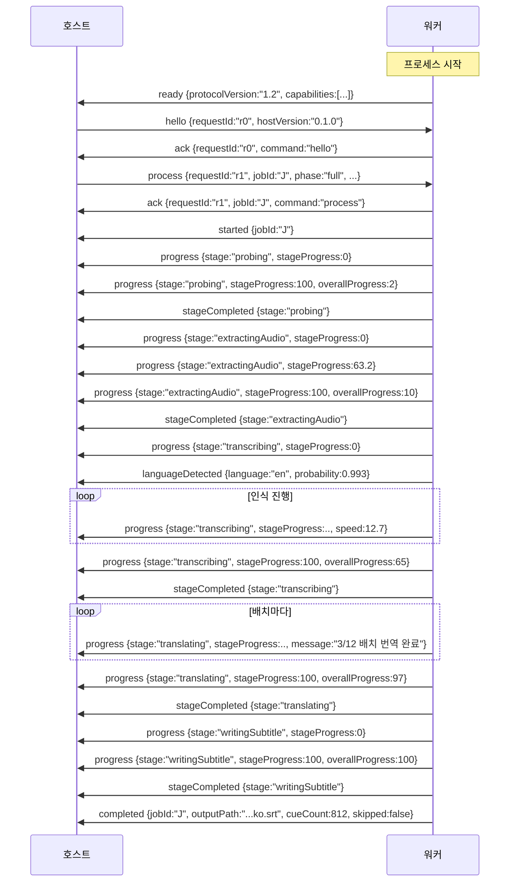
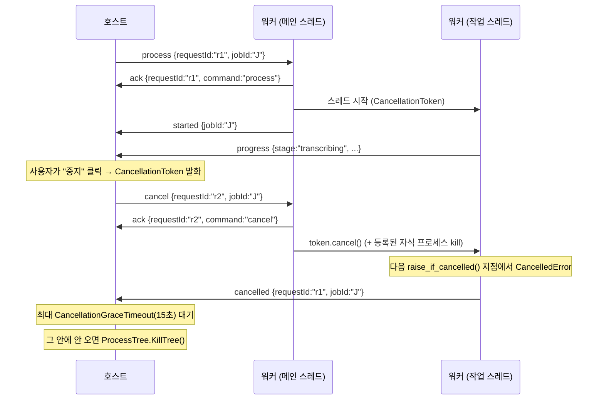

# 워커 프로토콜 (v1.5)

호스트(.NET)와 AI 워커(Python)가 주고받는 전체 계약입니다.

**정본은 `src/KSubMaker.WorkerProtocol/`** — `ProtocolConstants.cs`, `Commands.cs`, `Events.cs`,
`WorkerProtocolSerializer.cs` 입니다. `worker/ksubmaker_worker/protocol.py`는 그 거울이며, 이
문서는 양쪽을 읽어서 작성하고 교차 확인했습니다. 세 곳이 어긋나면 **C# 쪽이 맞습니다.**

---

## 1. 불변식

이 여섯 가지는 협상 대상이 아닙니다.

1. **한 줄 = JSON 객체 하나.** 줄바꿈은 `\n`. 들여쓰기 없는 컴팩트 JSON. Python은
   `json.dumps(..., ensure_ascii=False, separators=(",", ":"), allow_nan=False)`로 쓰고 즉시
   `flush()` 합니다.
2. **stdout은 프로토콜 전용, stderr는 로그.** 워커는 무거운 import를 하기 **전에**
   `protocol.install_stdout_guard()`를 호출해 진짜 stdout을 붙잡고 `sys.stdout`을 stderr로
   바꿔치기합니다. 모델 로더 안의 `print`가 채널을 깨는 대신 로그를 더럽힙니다.
3. **`requestId`로 상관관계를 맺습니다.** 호스트가 보낸 값을 워커가 그대로 되돌려 줍니다.
   채널은 완전히 비동기·교차 배치라 도착 순서로는 짝지을 수 없습니다.
   `WorkerProcessClient`는 명령을 쓰기 **전에** `TaskCompletionSource`를 등록합니다.
4. **깨진 줄은 건너뛰지, 치명적이지 않습니다.**
   - 호스트: `WorkerProtocolSerializer.DeserializeEvent`가 절대 예외를 던지지 않고
     `UnknownEvent { Raw, Reason }`을 돌려줍니다. 로그에 경고 한 줄, 읽기는 계속.
   - 워커: `Worker._parse`가 빈 줄, `{`로 시작하지 않는 줄, 잘못된 JSON, 객체가 아닌 JSON을
     경고만 남기고 무시합니다. 단, `command` 필드가 없으면 `PROTOCOL_ERROR` 이벤트를
     돌려줍니다(호스트가 응답을 기다리고 있을 수 있으므로).
5. **버전 협상: 주 버전이 다르면 치명적, 부 버전이 다르면 경고.**
   `ProtocolConstants.Version` == `protocol.PROTOCOL_VERSION` == `"1.5"`.
6. **비유한 부동소수는 금지.** `allow_nan=False`. `NaN`/`Infinity`는 JSON이 아니고
   `System.Text.Json`이 거부합니다. `speed` 필드에 `NaN` 하나가 들어가면 그 이벤트 전체가
   파싱 불가능해집니다. 직렬화가 실패하면 워커는 값을 `null`로 정화해 **다시 시도**합니다 —
   `completed` 이벤트가 사라지면 작업 하나를 통째로 잃기 때문입니다.

### 인코딩과 프로세스 환경

| 항목 | 값 | 설정 위치 |
| --- | --- | --- |
| stdin/stdout/stderr 인코딩 | **BOM 없는 UTF-8** | `WorkerProcessClient.BuildStartInfo` |
| `PYTHONIOENCODING` | `utf-8` | 같음 |
| `PYTHONUNBUFFERED` | `1` | 같음 |
| `PYTHONPATH` | 저장소의 `worker/` (소스 트리 실행 모드에서만) | `ToolLocator.PythonPath` |
| `KSUBMAKER_MODELS_DIR` | `IAppPaths.ModelsDirectory` (설정 화면에서 옮길 수 있음) | `WorkerProcessClient.ApplyPathEnvironment` |
| `KSUBMAKER_TOOLS_DIR` | `IAppPaths.ToolsDirectory` (`<앱 폴더>/tools`) | 같음 |
| `HF_HOME` | `<모델 폴더>/.hf-cache` | 같음 |
| stdin 자동 플러시 | **끔.** 줄 단위로 명시적 플러시 | `WorkerProcessClient` |

호스트 stdin에 AutoFlush를 쓰지 않는 이유는, 절반만 쓰인 줄이 워커의 `readline()`에 도달하면
프로토콜이 어긋나기 때문입니다.

**경로를 프로토콜 필드가 아니라 환경 변수로 넘기는 이유.** 워커는 작업이 도착하기 **전에**
모델 위치를 알아야 합니다. `CommandHandlers.__init__`이 `models_root()`로 모델 관리자·인식기·
번역기를 만들고, `listModels`/`verifyModel`은 아예 작업 밖에서 돕니다. 작업별 필드로 넘기면
이 모두가 여전히 기본 위치를 바라봅니다. 호스트가 넣은 값이 기존 환경 변수보다 우선합니다 —
경로의 정본은 설정 화면입니다. 읽는 쪽은 `model_manager.models_root()`,
`ffmpeg_service._candidate_roots()`, `llm_translator.find_llama_server()` 입니다.

---

## 2. 명령 (호스트 → 워커)

모든 명령은 공통 필드를 갖습니다.

| 필드 | 타입 | 필수 | 의미 |
| --- | --- | --- | --- |
| `command` | string | ✔ | 판별자. 아래 12개 중 하나 |
| `requestId` | string | ✔ | 상관관계 키. 기본값은 `Guid.NewGuid().ToString("n")` |
| `protocolVersion` | string | ✔ | 호스트의 프로토콜 버전. 기본 `"1.5"` |

> **현재 호스트가 실제로 보내는 명령은 `hello`, `detectHardware`, `process`, `extractAudio`,
> `cancel`, `shutdown` 여섯입니다.** `probe`, `listModels`, `downloadModel`, `cancelDownload`,
> `verifyModel`, `deleteModel`은 워커에 완전히 구현되어 있지만 호스트가 C# 쪽 구현(ffprobe,
> HTTP 다운로더)을 직접 쓰고 있습니다. 자세한 내용은
> [ARCHITECTURE.md §11](ARCHITECTURE.md#11-현재-구현되지-않은-것--알려진-격차).

---

### 2.1 `hello`

핸드셰이크. 워커는 이미 `ready`를 보낸 뒤이므로 이것은 **호스트가 자기 버전을 알리는** 명령입니다.

| 필드 | 타입 | 필수 | 의미 |
| --- | --- | --- | --- |
| `hostVersion` | string? | | 호스트 버전 문자열. 정보용 (`WorkerOptions.HostVersion`) |

```json
{"command":"hello","requestId":"9c2f0f1b8a7d4e0f9b1c","protocolVersion":"1.2","hostVersion":"0.1.0"}
```

응답: `ack`. 버전이 어긋나면 `ack` **앞에** `log` 이벤트가 하나 더 옵니다
(주 버전 불일치면 `level:"error"`, 단순 미보고면 `level:"warn"`).

---

### 2.2 `detectHardware`

인자 없음. 응답은 `hardware` 이벤트.

```json
{"command":"detectHardware","requestId":"7f1e...","protocolVersion":"1.2"}
```

**호스트가 언제 보내는가.** `WorkerHardwareProbe`가 보내며, 시점은 두 가지뿐입니다.

1. 워커가 **다른 이유로 이미 떠 있을 때** — 첫 작업이 워커를 띄운 직후,
   `WorkerJobProcessor.EnsureStartedAsync`가 `process`를 보내기 전에 한 번.
2. 설정 화면의 **새로 고침**을 눌렀을 때. 이때만 하드웨어 확인을 위해 워커를 새로 띄웁니다.

시작할 때는 보내지 않습니다. 아직 아무것도 하지 않은 사용자를 위해 CPython을 띄우고 torch를
import하는 것은 수 초를 그냥 버리는 일입니다. 응답은 `HardwareProfile.MergeWorkerReport`가
로컬 감지 결과 위에 덮어씁니다 — CUDA 사용 가능 여부와 GPU별 여유 VRAM은 워커가 정본이고,
CPU·RAM·디스크는 호스트가 정본입니다. 워커가 답하지 못하면 로컬 결과를 그대로 씁니다.

---

### 2.3 `probe`

| 필드 | 타입 | 필수 | 의미 |
| --- | --- | --- | --- |
| `videoPath` | string | ✔ | 절대 경로 |

```json
{"command":"probe","requestId":"a41b...","protocolVersion":"1.2","videoPath":"D:\\Videos\\ep01.mkv"}
```

응답은 `probeResult`. 파일을 못 읽어도 **오류 이벤트가 아니라** `probeResult.error`에
사유가 담깁니다. `videoPath`가 비어 있거나 문자열이 아니면 그때는 `error`(`PROTOCOL_ERROR`)입니다.

---

### 2.4 `process`

파이프라인 전체를 도는 명령. 이 프로토콜의 중심입니다.

| 필드 | 타입 | 필수 | 의미 |
| --- | --- | --- | --- |
| `jobId` | string | ✔ | 작업 식별자. 모든 후속 이벤트에 되돌아옵니다 |
| `videoPath` | string | ✔ | 원본 영상 절대 경로 |
| `outputPath` | string | ✔ | 저장할 `*.ko.srt` 절대 경로 |
| `checkpointDir` | string | ✔ | 이 작업의 체크포인트 디렉터리(`cache/{jobId}`) |
| `settings` | object | ✔ | 아래 §2.4.1 |
| `sourceMode` | string | | `"audio"`(기본) / `"embeddedSubtitle"` / `"externalSubtitle"`(**v1.5**) |
| `audioTrackIndex` | int? | | null이면 FFmpeg 기본 트랙 |
| `subtitleTrackIndex` | int? | | `sourceMode="embeddedSubtitle"`일 때 쓸 트랙 |
| `subtitlePath` | string? | | **v1.5.** `sourceMode="externalSubtitle"`일 때 번역할 자막 파일의 절대 경로. **어느 파일을 쓸지는 호스트가 정합니다**(`ExternalSubtitleSelector`) — 워커는 디렉터리를 뒤지지 않으므로 우선순위 규칙이 한 언어에만 존재합니다 |
| `subtitleLanguage` | string? | | **v1.1.** 그 자막 트랙의 언어(ISO-639-1/2). 없으면 워커가 `en`으로 가정합니다. 컨테이너의 언어 태그는 비어 있거나 틀린 경우가 많아 사용자가 고른 값을 여기로 보냅니다 |
| `resume` | bool | | 기본 `true`. false면 체크포인트를 지우고 처음부터 |
| `phase` | string | | `"full"`(기본) / `"transcribe"` / `"translate"` |

#### 2.4.1 `settings` 객체 (`WorkerJobSettings`)

| 필드 | 타입 | 기본값 | 의미 |
| --- | --- | --- | --- |
| `language` | string | `"auto"` | ISO-639-1 코드 또는 `auto`(자동 감지) |
| `whisperModel` | string | `"auto"` | 모델 id 또는 `auto` (워커 기본값 `whisper-small`) |
| `computeType` | string? | (없음) | `float32`/`float16`/`bfloat16`/`int8_float16`/`int8`. **null이면 필드 자체가 JSON에서 빠집니다**(`WhenWritingNull`) |
| `device` | string | `"auto"` | `auto`/`cuda`/`cpu`. 호스트는 항상 `"auto"`를 보냅니다 |
| `beamSize` | int | `5` | 빔 서치 폭 |
| `vadFilter` | bool | `true` | 무음 구간 제거 |
| `wordTimestamps` | bool | `true` | 단어 단위 타임스탬프. 번역 전 세그먼트 분할에 필요 |
| `conditionOnPreviousText` | bool | `false` | 기본 꺼짐. [ADR-010](DECISIONS.md#adr-010--condition_on_previous_text는-기본-꺼짐) |
| `initialPrompt` | string? | `null` | **v1.4.** Whisper 디코더 앞에 붙이는 힌트. 고유명사·등장인물 이름 표기를 고정하는 데 씁니다. `null`이면 워커의 언어별 기본 힌트를 그대로 쓰고, 값이 있으면 **대체**합니다(합치지 않음). **첫 디코딩 윈도우에만 적용됩니다** — `conditionOnPreviousText`가 꺼져 있으면 faster-whisper가 그 뒤로 프롬프트를 문맥에서 버립니다 |
| `translationEngine` | string | `"local-translation"` | `local-translation` / `local-llm` / `fake` |
| `translationModel` | string | `"auto"` | NLLB 모델 id (워커 기본값 `nllb-200-distilled-600M`) |
| `llmModel` | string | `"auto"` | GGUF 모델 id (워커 기본값 `qwen2.5-3b-instruct-q4km`) |
| `translationStyle` | string | `"natural"` | `natural`/`literal`/`polite`/`casual`/`preserve` |
| `batchMaxItems` | int | `30` | 배치를 닫는 항목 수 |
| `batchMaxChars` | int | `2500` | 배치를 닫는 문자 수 |
| `batchMaxSeconds` | int | `180` | 배치가 덮는 미디어 초 |
| `contextLines` | int | `3` | 앞 배치에서 읽기 전용 문맥으로 넘길 줄 수 |
| `glossary` | object | `{}` | `{원문 용어: 한국어}` |
| `maxLinesPerCue` | int | `2` | 큐당 최대 줄 수 |
| `maxCharsPerLine` | int | `22` | 줄당 최대 글자 수 |
| `minCueDurationSeconds` | double | `1.0` | 큐 최소 길이 |
| `maxCueDurationSeconds` | double | `7.0` | 큐 최대 길이. 세그먼트 분할에도 쓰입니다 |
| `minCueGapMilliseconds` | int | `50` | 인접 큐 사이 최소 간격 |
| `mergeShortCues` | bool | `true` | 너무 짧은 큐 병합 |
| `outputConflictPolicy` | string | `"skip"` | **v1.1.** 대상 파일이 이미 있을 때: `skip`(그대로 두고 `completed.skipped=true`) / `overwrite` / `numbered`(`이름 (2).ko.srt`). 필드가 없으면 `skip` |
| `autoRetryOnRecoverableError` | bool | `true` | 복구 가능한 오류에서 자동 재시도 |

`outputConflictPolicy`의 와이어 값은 C# 열거형 이름과 **일부러 다릅니다**
(`CreateNumberedCopy` → `numbered`). 상수는 `OutputConflictPolicies`(C#)와
`subtitle_writer.CONFLICT_*`(Python) 양쪽에 있습니다. 알 수 없는 값은 `skip`으로 떨어지므로,
새 정책을 한쪽에만 추가해도 사용자 파일을 덮어쓰는 일은 없습니다.

#### 예시

```json
{"command":"process","requestId":"3d0a5e9c1b2f4a6d8e7c","protocolVersion":"1.2","jobId":"7b1c4e2f9a0d4c6b","videoPath":"D:\\Videos\\Series\\S01E03.mkv","outputPath":"D:\\Videos\\Series\\S01E03.ko.srt","checkpointDir":"C:\\Users\\hong\\AppData\\Local\\KSubMaker\\cache\\7b1c4e2f9a0d4c6b","sourceMode":"audio","resume":true,"phase":"full","settings":{"language":"auto","whisperModel":"whisper-large-v3-turbo","computeType":"int8_float16","device":"auto","beamSize":5,"vadFilter":true,"wordTimestamps":true,"conditionOnPreviousText":false,"translationEngine":"local-translation","translationModel":"nllb-200-distilled-600M","llmModel":"auto","translationStyle":"natural","batchMaxItems":30,"batchMaxChars":2500,"batchMaxSeconds":180,"contextLines":3,"glossary":{"Sherlock":"셜록","Baker Street":"베이커가"},"maxLinesPerCue":2,"maxCharsPerLine":22,"minCueDurationSeconds":1.0,"maxCueDurationSeconds":7.0,"minCueGapMilliseconds":50,"mergeShortCues":true,"outputConflictPolicy":"skip","autoRetryOnRecoverableError":true}}
```

#### `phase` 값

| 값 | 동작 | 쓰이는 곳 |
| --- | --- | --- |
| `full` | 프로빙 → 오디오 추출 → 인식 → 번역 → 저장 | 처리 방식 A |
| `transcribe` | 인식까지만 하고 `transcription.json`을 남기고 멈춤. **`completed` 이벤트를 `skipped:true`로 보냅니다**(파일을 쓰지 않았다는 뜻) | 방식 B 1패스, 방식 C 인식 레인 |
| `translate` | 체크포인트의 인식 결과에서 이어받아 번역·저장 | 방식 B 2패스, 방식 C 번역 레인 |

`phase`가 셋 중 하나가 아니면 `PROTOCOL_ERROR`. `translate`인데 체크포인트가 없으면
`TRANSCRIPTION_FAILED`("이어서 번역할 음성 인식 결과가 없습니다").

---

### 2.5 `extractAudio` (v1.3)

앞으로 처리할 파일의 음성을 **미리** 뽑아 둡니다. 큐가 그 파일에 도달했을 때 추출 단계가 이미
끝나 있게 하는 것이 목적입니다.

| 필드 | 타입 | 필수 | 의미 |
| --- | --- | --- | --- |
| `jobId` | string | ✔ | 나중에 이 파일을 처리할 작업의 id |
| `videoPath` | string | ✔ | 원본 영상 |
| `checkpointDir` | string | ✔ | 같은 작업의 `process`가 쓸 것과 **동일한** 디렉터리 |
| `settings` | object | ✔ | `process`와 같은 블록. 워커가 `sourceMode`·`audioTrackIndex`를 지문으로 기록합니다 |
| `sourceMode` | string | | `audio`(기본) / `embeddedSubtitle` / `externalSubtitle`. 뒤의 둘은 아무것도 하지 않습니다 |
| `audioTrackIndex` | int? | | null이면 FFmpeg 기본 트랙 |

```json
{"command":"extractAudio","requestId":"e91c...","protocolVersion":"1.3","jobId":"7b1c4e2f9a0d4c6b","videoPath":"D:\\Videos\\Series\\S01E04.mkv","checkpointDir":"C:\\Users\\hong\\AppData\\Local\\KSubMaker\\cache\\7b1c4e2f9a0d4c6b","sourceMode":"audio","audioTrackIndex":null,"settings":{"language":"auto"}}
```

**다른 모든 명령과 달리 `process`가 도는 중에도 실행됩니다.** 나머지가 직렬화되는 이유는 CUDA
작업 둘이 같은 VRAM을 두고 싸우기 때문인데, 이 명령은 ffmpeg만 돌리므로 그 이유가 적용되지
않습니다. 워커는 이 명령 전용 스레드를 따로 둡니다.

동작:
* 즉시 `ack`.
* 성공하면 `completed`(`skipped:true`, `cueCount:0`, `outputPath:""`). 자막을 쓴 게 아니라
  준비만 한 것이므로 산출물이 없습니다.
* **"이 음성을 쓰라"는 별도 명령은 없습니다.** 작업이 스스로 썼을 `audio.wav`와 체크포인트
  기록을 그대로 남기므로, 뒤따르는 `process`는 추출 단계가 끝나 있는 것을 발견하고 건너뜁니다.
* 실패는 전부 `recoverable:true`입니다. 미리 추출이 실패해도 작업이 제 몫을 다시 하면 되므로,
  손해는 아꼈을 시간뿐입니다.
* 추출이 이미 돌고 있으면 `PROTOCOL_ERROR`로 거절합니다. 호스트는 하나씩 보내고 응답을
  기다립니다.
* **1.2 이하 워커는 `PROTOCOL_ERROR`("알 수 없는 명령")로 답합니다.** 호스트는 이를 "미리
  추출 불가"로 받아들이고 그대로 진행합니다 — 1.3이 부 버전 증가인 이유입니다.

같은 작업의 `process`와 동시에 도착할 수 있고(호스트가 파일 N을 시작했는데 파일 N의 미리
추출이 아직 안 끝난 경우), 그때 둘 다 같은 `audio.wav.tmp`에 ffmpeg를 걸면 찢어진 wav가
남습니다. 워커는 **체크포인트 디렉터리별 잠금**으로 이를 막습니다. 나중에 들어온 쪽은 먼저
끝난 wav를 발견해 재사용합니다.

---

### 2.6 `cancel`

| 필드 | 타입 | 필수 | 의미 |
| --- | --- | --- | --- |
| `jobId` | string? | | null이면 **지금 돌고 있는 것**을 취소 |

```json
{"command":"cancel","requestId":"b8e2...","protocolVersion":"1.2","jobId":"7b1c4e2f9a0d4c6b"}
```

동작:
* 즉시 `ack`.
* 도는 작업이 없으면 곧바로 `cancelled`.
* `jobId`가 지정됐는데 다른 작업이 돌고 있으면 `log`(`level:"warn"`)만 보내고 아무것도 취소하지
  않습니다.
* 일치하면 취소 토큰을 발화시킵니다. **`cancelled` 이벤트는 작업 스레드가 보냅니다** — 여기서
  같이 보내면 중복 보고가 됩니다.
* **미리 추출 레인도 함께 봅니다(v1.3).** 작업이 돌고 있지 않아도 그 `jobId`의 미리 추출이
  진행 중일 수 있으므로, 작업만 보고 "돌고 있는 것 없음"으로 답하면 사용자가 방금 포기한
  파일에 ffmpeg가 계속 매달려 있게 됩니다.
* CUDA 커널은 파이썬에서 중단할 수 없으므로 즉시 멈추지 않습니다. 호스트는
  `WorkerOptions.CancellationGraceTimeout`(기본 15초)만큼 기다린 뒤 프로세스 트리를 죽입니다.

---

### 2.7 `listModels`

인자 없음. 응답은 `modelList`.

---

### 2.8 `downloadModel`

| 필드 | 타입 | 필수 | 의미 |
| --- | --- | --- | --- |
| `modelId` | string | ✔ | 카탈로그 id |
| `repositoryId` | string | ✔ | Hugging Face 저장소 (`Systran/faster-whisper-large-v3` 등) |
| `files` | string[] | ✔ | 저장소 기준 상대 경로 목록 |
| `targetDir` | string | ✔ | 받을 디렉터리 |

```json
{"command":"downloadModel","requestId":"c19f...","protocolVersion":"1.2","modelId":"whisper-small","repositoryId":"Systran/faster-whisper-small","files":["config.json","model.bin","tokenizer.json","vocabulary.txt"],"targetDir":"C:\\Users\\hong\\AppData\\Local\\KSubMaker\\models\\whisper-small"}
```

응답: `ack` → `downloadProgress` 여러 개(0.5초 스로틀) → `downloadCompleted`.

---

### 2.9 `cancelDownload`

| 필드 | 타입 | 필수 |
| --- | --- | --- |
| `modelId` | string | ✔ |

`ack`를 보내고, 해당 다운로드가 없으면 `log`(`warn`)를 덧붙입니다.

---

### 2.10 `verifyModel` / 2.11 `deleteModel`

| 필드 | 타입 | 필수 |
| --- | --- | --- |
| `modelId` | string | ✔ |
| `targetDir` | string | ✔ |

둘 다 응답은 `modelList`(원소 하나짜리)입니다. `verifyModel`은 작업 스레드에서 돌아
취소할 수 있고(`cancelled` 가능), `deleteModel`은 즉시 처리됩니다.

---

### 2.12 `shutdown`

인자 없음. `ack` → (도는 작업이 있으면 취소하고 최대 20초 대기) → 모델 언로드 →
자식 프로세스 정리 → `goodbye` → 종료 코드 0.

---

## 3. 이벤트 (워커 → 호스트)

모든 이벤트의 공통 필드:

| 필드 | 타입 | 필수 | 의미 |
| --- | --- | --- | --- |
| `type` | string | ✔ | 판별자 |
| `requestId` | string? | | 특정 명령에 대한 답일 때 원본 값을 되돌려 줍니다 |
| `jobId` | string? | | 작업과 연관된 이벤트일 때 |

> Python은 값이 없는 선택 필드를 **아예 쓰지 않습니다**(키 자체가 없음). C# 역직렬화는
> `PropertyNameCaseInsensitive` + 누락 허용이라 문제없습니다.

---

### 3.1 `ready`

프로세스가 뜨자마자 **명령을 받기 전에** 보냅니다. 호스트의 `StartAsync`는 이것을
`WorkerOptions.StartupTimeout`(기본 60초) 안에 기다립니다.

| 필드 | 타입 | 필수 | 의미 |
| --- | --- | --- | --- |
| `protocolVersion` | string | ✔ | 워커의 프로토콜 버전 |
| `workerVersion` | string? | | 패키지 버전 (`ksubmaker_worker.__version__`) |
| `pythonVersion` | string? | | `platform.python_version()` |
| `capabilities` | string[] | | 현재 `["asr","translate","llm","probe","hardware","models"]` |

```json
{"type":"ready","protocolVersion":"1.2","workerVersion":"1.0.0","pythonVersion":"3.11.9","capabilities":["asr","translate","llm","probe","hardware","models"]}
```

---

### 3.2 `ack`

| 필드 | 타입 | 필수 | 의미 |
| --- | --- | --- | --- |
| `command` | string? | | 승인한 명령 이름 |

```json
{"type":"ack","requestId":"3d0a5e9c1b2f4a6d8e7c","jobId":"7b1c4e2f9a0d4c6b","command":"process"}
```

---

### 3.3 `started`

작업이 실제로 시작됐음.

| 필드 | 타입 | 필수 | 의미 |
| --- | --- | --- | --- |
| `resumedFromStage` | string? | | 체크포인트에서 이어받았을 때 그 단계. 현재는 인식 결과가 있을 때 `"translating"` |

```json
{"type":"started","requestId":"3d0a...","jobId":"7b1c4e2f9a0d4c6b","resumedFromStage":"translating"}
```

---

### 3.4 `progress`

| 필드 | 타입 | 필수 | 의미 |
| --- | --- | --- | --- |
| `stage` | string | ✔ | §4의 단계 이름 |
| `stageProgress` | double | ✔ | 0–100, 소수 2자리 |
| `overallProgress` | double | ✔ | 0–100. 단계 가중치를 적용한 값 |
| `speed` | double? | | 벽시계 1초당 처리한 **미디어 초** |
| `message` | string? | | 한국어 보조 문구 (예: `"3/12 배치 번역 완료"`) |

```json
{"type":"progress","requestId":"3d0a...","jobId":"7b1c4e2f9a0d4c6b","stage":"transcribing","stageProgress":42.5,"overallProgress":33.38,"speed":12.7}
```

`overallProgress`는 워커가 계산해 보내지만, 호스트도 `ProgressCalculator.Overall`로 같은 값을
계산할 수 있습니다. 양쪽 가중치와 반올림(소수 2자리)이 동일하므로 막대가 튀지 않습니다.

---

### 3.5 `languageDetected`

| 필드 | 타입 | 필수 | 의미 |
| --- | --- | --- | --- |
| `language` | string | ✔ | ISO-639-1 |
| `probability` | double | ✔ | 0–1, 소수 4자리 |

```json
{"type":"languageDetected","jobId":"7b1c4e2f9a0d4c6b","language":"en","probability":0.9932}
```

---

### 3.6 `stageCompleted`

| 필드 | 타입 | 필수 |
| --- | --- | --- |
| `stage` | string | ✔ |

```json
{"type":"stageCompleted","jobId":"7b1c4e2f9a0d4c6b","stage":"extractingAudio"}
```

---

### 3.7 `completed`

작업의 **터미널 이벤트** 중 하나. 성공 경로.

| 필드 | 타입 | 필수 | 의미 |
| --- | --- | --- | --- |
| `outputPath` | string | ✔ | 실제로 쓴 경로. 건너뛴 경우엔 쓰려던 경로 |
| `cueCount` | int | ✔ | 큐 개수 (`phase="transcribe"`일 땐 세그먼트 수) |
| `sourceLanguage` | string? | | 감지·지정된 원본 언어 |
| `whisperModel` | string? | | 실제로 쓴 모델 id |
| `translationEngine` | string? | | `local-translation` / `local-llm` / `fake` |
| `translationModel` | string? | | 실제로 쓴 번역 모델 id |
| `elapsedSeconds` | double | ✔ | 소수 3자리 |
| `skipped` | bool | ✔ | **true면 파일을 쓰지 않았습니다** |

`skipped:true`가 되는 두 경우:
1. 출력 충돌 정책이 `skip`이고 대상 파일이 이미 있을 때
2. `phase="transcribe"`로 끝났을 때(정의상 파일을 쓰지 않음)

```json
{"type":"completed","requestId":"3d0a...","jobId":"7b1c4e2f9a0d4c6b","outputPath":"D:\\Videos\\Series\\S01E03.ko.srt","cueCount":812,"sourceLanguage":"en","whisperModel":"whisper-large-v3-turbo","translationEngine":"local-translation","translationModel":"nllb-200-distilled-600M","elapsedSeconds":436.812,"skipped":false}
```

---

### 3.8 `error`

터미널 이벤트. 실패 경로.

| 필드 | 타입 | 필수 | 의미 |
| --- | --- | --- | --- |
| `code` | string | ✔ | `ErrorCodes`의 값 22개 중 하나 |
| `message` | string | ✔ | **한국어**. 사용자에게 그대로 보여도 되는 문장 |
| `recoverable` | bool | ✔ | true면 호스트가 자동 재시도해도 됨 |
| `detail` | string? | | 기술적 세부. **최대 4000자로 잘립니다.** UI에 그대로 나가지 않고 로그로만 갑니다 |

```json
{"type":"error","requestId":"3d0a...","jobId":"7b1c4e2f9a0d4c6b","code":"CUDA_OUT_OF_MEMORY","message":"GPU 메모리가 부족합니다. 설정에서 더 작은 모델을 선택하거나 정밀도를 int8로 낮춘 뒤 다시 시도하세요.","recoverable":true,"detail":"RuntimeError('CUDA failed with error out of memory')"}
```

`detail`을 자르는 이유는, 멀티메가바이트 트레이스백 한 줄이 호스트의 줄 단위 리더를 멈추게
하기 때문입니다.

전체 코드 목록과 각각의 대처법은 [`TROUBLESHOOTING.md`](TROUBLESHOOTING.md)에 있습니다.

---

### 3.9 `cancelled`

터미널 이벤트. 취소 경로. 추가 필드 없음.

```json
{"type":"cancelled","requestId":"3d0a...","jobId":"7b1c4e2f9a0d4c6b"}
```

---

### 3.10 `log`

| 필드 | 타입 | 필수 | 의미 |
| --- | --- | --- | --- |
| `level` | string | | `debug`/`info`/`warn`/`error`. 기본 `"info"` |
| `message` | string | ✔ | 한국어 |

CUDA OOM 사다리가 무엇을 하고 있는지, 원본이 바뀌어 처음부터 다시 한다든지 같은 것을 알립니다.

```json
{"type":"log","jobId":"7b1c4e2f9a0d4c6b","level":"warn","message":"GPU 메모리가 부족하여 번역 설정을 낮추고 다시 시도합니다."}
```

---

### 3.11 `hardware`

`detectHardware`의 응답.

| 필드 | 타입 | 의미 |
| --- | --- | --- |
| `gpus` | GpuDto[] | 아래 |
| `cudaAvailable` | bool | 추론 스택이 **실제로 쓸 수 있는** CUDA가 있는가. **v1.2부터 `cudaDeviceDetected && cudaLibrariesAvailable`의 논리곱입니다** |
| `cudaDeviceDetected` | bool | **v1.2.** `ctranslate2.get_cuda_device_count() > 0`. 이것은 **드라이버**가 동작한다는 뜻일 뿐입니다 |
| `cudaLibrariesAvailable` | bool | **v1.2.** cuBLAS(CUDA 12)와 cuDNN 9가 실제로 로드되었는가. 필드가 없으면(1.1 워커) 호스트는 `true`로 읽습니다 — 없는 고장을 지어내지 않기 위해서입니다. Windows 외 플랫폼에서는 언제나 `true`입니다(§3.11 아래 설명) |
| `missingCudaLibraries` | string[] | **v1.2.** 로드에 실패한 파일 이름. 예 `["cublas64_12.dll"]` |
| `cudaVersion` | string? | |
| `cpuName` | string? | |
| `logicalCores` | int | |
| `totalRamBytes` | long | |
| `availableRamBytes` | long | |
| `warnings` | string[] | 한국어 경고 (설정 화면에 표시) |

**왜 둘로 나뉘어 있는가 (v1.2).** `get_cuda_device_count()`는 드라이버만 있으면 0보다 큰 값을
돌려줍니다. 그런데 `ctranslate2 >= 4.5`가 모델을 올릴 때 필요한 것은 cuBLAS(CUDA 12)와
cuDNN 9이고, 그 둘은 드라이버에도 `ctranslate2` 휠에도 들어 있지 않습니다. 실제 사용자 기계
(RTX 3080 Ti, 드라이버 CUDA 13.1)에서 `cudaAvailable=true`가 보고되었고, 앱은 GPU 모델을
권장했고, 첫 작업이 이렇게 죽었습니다:

```
RuntimeError('Library cublas64_12.dll is not found or cannot be loaded')
```

그래서 워커는 검색 경로를 등록한 뒤(`worker/ksubmaker_worker/cuda_setup.py`) `ctypes.WinDLL`로
`cublas64_12.dll`과 `cudnn64_9.dll`을 **실제로 로드해 보고**, 성공했을 때만 `cudaAvailable`을
참으로 만듭니다. 이 로드 검사는 **Windows 전용**입니다 — 문제가 Windows DLL 검색 경로에서
비롯되기 때문이며, Linux 휠은 `RPATH`로 같은 라이브러리를 찾습니다.

**GpuDto**

| 필드 | 타입 | 의미 |
| --- | --- | --- |
| `index` | int | |
| `name` | string | |
| `totalVramBytes` | long | |
| `freeVramBytes` | long | |
| `driverVersion` | string? | |
| `computeCapability` | string? | 예 `"8.6"` |

```json
{"type":"hardware","requestId":"7f1e...","gpus":[{"index":0,"name":"NVIDIA GeForce RTX 4070","totalVramBytes":12884901888,"freeVramBytes":11811160064,"driverVersion":"552.22","computeCapability":"8.9"}],"cudaAvailable":true,"cudaDeviceDetected":true,"cudaLibrariesAvailable":true,"missingCudaLibraries":[],"cudaVersion":"12.4","cpuName":"AMD Ryzen 7 5800X 8-Core Processor","logicalCores":16,"totalRamBytes":34359738368,"availableRamBytes":21474836480,"warnings":[]}
```

같은 기계에서 CUDA 지원 라이브러리만 없을 때 (v1.2):

```json
{"type":"hardware","requestId":"7f1e...","gpus":[{"index":0,"name":"NVIDIA GeForce RTX 3080 Ti","totalVramBytes":12884901888,"freeVramBytes":12079595520,"driverVersion":"581.15","computeCapability":"8.6"}],"cudaAvailable":false,"cudaDeviceDetected":true,"cudaLibrariesAvailable":false,"missingCudaLibraries":["cublas64_12.dll"],"cudaVersion":"13.1","cpuName":"AMD Ryzen 7 5800X 8-Core Processor","logicalCores":16,"totalRamBytes":34359738368,"availableRamBytes":21474836480,"warnings":["NVIDIA GPU와 드라이버는 정상이지만 CUDA 지원 라이브러리(cublas64_12.dll)를 찾지 못했습니다. ..."]}
```

**호스트가 이 응답으로 무엇을 하는가.** `HardwareProfile.MergeWorkerReport`가 로컬 감지 결과에
접어 넣습니다.

| 항목 | 정본 | 이유 |
| --- | --- | --- |
| `cudaAvailable` | **워커** | 모델을 실제로 올리는 프로세스입니다. 드라이버만 보고 판단한 호스트의 "가능"이 워커의 "불가능"을 이길 수 없고, 그 반대(호스트 오탐지 교정)도 마찬가지입니다 |
| `cudaDeviceDetected` / `cudaLibrariesAvailable` / `missingCudaLibraries` | **워커** | v1.2. 호스트는 이 값들을 다시 계산하지 않고 그대로 저장합니다. `HardwareProfile.CudaBlockedByMissingLibraries`가 "GPU는 멀쩡한데 라이브러리가 없다"를 판별하고, `HardwareRecommendationPolicy`가 그때만 다른 안내 문구를 씁니다 |
| `cudaVersion` | 워커(비어 있으면 로컬 유지) | |
| GPU별 `freeVramBytes` | 워커, 인덱스로 대응 | 모델을 올리는 그 시점의 값이기 때문입니다 |
| GPU 이름·총 VRAM·드라이버·compute capability | 로컬 | nvidia-smi가 이미 보고했고 워커는 같은 값을 되풀이할 뿐입니다 |
| CPU·RAM·디스크 | 로컬 | 워커가 더할 것이 없습니다 |
| `warnings` | 합집합(로컬 먼저, 중복 제거) | 단, 워커가 CUDA를 쓸 수 있다고 답하면 `HardwareWarnings.RetractedWhenCudaWorks`에 있는 로컬 CUDA 경고는 **철회**됩니다. 방금 뒤집힌 판정을 설정 화면에 남겨 두면 자기모순입니다 |

병합 후 `HardwareRecommendationPolicy.Recommend`가 다시 돌고 `HardwareService.ProfileChanged`가
한 번 더 발생합니다.

---

### 3.12 `probeResult`

`probe`의 응답.

| 필드 | 타입 | 의미 |
| --- | --- | --- |
| `videoPath` | string | |
| `durationSeconds` | double | |
| `audioTracks` | AudioTrackDto[] | |
| `subtitleTracks` | SubtitleTrackDto[] | |
| `container` | string? | |
| `error` | string? | **null이 아니면 읽기 실패.** 오류 이벤트가 아니라 여기에 담깁니다 |

**AudioTrackDto**: `index`(int), `language`(string?), `title`(string?), `codec`(string?),
`channels`(int), `isDefault`(bool)

**SubtitleTrackDto**: `index`(int), `language`(string?), `title`(string?), `codec`(string?),
`isForced`(bool), `isDefault`(bool)

```json
{"type":"probeResult","requestId":"a41b...","videoPath":"D:\\Videos\\ep01.mkv","durationSeconds":1432.416,"container":"matroska,webm","audioTracks":[{"index":0,"language":"jpn","title":"Japanese 5.1","codec":"aac","channels":6,"isDefault":true}],"subtitleTracks":[{"index":0,"language":"eng","title":"Full","codec":"subrip","isForced":false,"isDefault":true}]}
```

---

### 3.13 `modelList`

`listModels`, `verifyModel`, `deleteModel`의 응답.

| 필드 | 타입 |
| --- | --- |
| `models` | InstalledModelDto[] |

**InstalledModelDto**

| 필드 | 타입 | 의미 |
| --- | --- | --- |
| `modelId` | string | |
| `path` | string? | 디스크 위치 |
| `installed` | bool | 파일이 전부 있는가 |
| `verified` | bool | 매니페스트와 해시가 맞는가 |
| `sizeBytes` | long | |
| `downloadedBytes` | long | 부분 다운로드 진행량 |
| `message` | string? | 한국어 상태 문구 |

---

### 3.14 `downloadProgress`

| 필드 | 타입 | 의미 |
| --- | --- | --- |
| `modelId` | string | |
| `receivedBytes` | long | |
| `totalBytes` | long | |
| `percent` | double | 0–100, 소수 2자리 |
| `currentFile` | string? | 지금 받는 파일 |
| `speedBytesPerSecond` | double | |

**0.5초마다만 보냅니다**(마지막 청크는 예외). 256KiB 청크로 3GB를 받으면 스로틀이 없을 때
1만 2천 건이 나갑니다.

---

### 3.15 `downloadCompleted`

| 필드 | 타입 | 의미 |
| --- | --- | --- |
| `modelId` | string | |
| `path` | string? | |
| `verified` | bool | |
| `totalBytes` | long | |
| `cancelled` | bool | 취소로 끝났는가 |

---

### 3.16 `goodbye`

종료 직전 마지막 이벤트. 추가 필드 없음.

---

### 3.17 `unknown` (호스트 내부 전용)

**워커는 절대 보내지 않습니다.** 이해할 수 없는 줄을 만났을 때 호스트가 합성하는 이벤트입니다.
한 줄의 오류가 경고 로그가 되지 크래시가 되지 않게 하려는 장치입니다.

| 필드 | 타입 | 의미 |
| --- | --- | --- |
| `raw` | string | 원래 줄 |
| `reason` | string? | `"빈 줄"`, `"JSON 객체가 아닙니다"`, `"type 필드가 없습니다"`, `"알 수 없는 이벤트 유형: …"`, `"JSON 구문 오류: …"` |

---

## 4. `stage` 값

`ProtocolConstants.Stages` == `protocol.Stages`. 도메인의 `JobStage`를 lower-camel-case 한 것.

| 와이어 값 | `JobStage` | 진행률 가중치 |
| --- | --- | --- |
| `probing` | `Probing` | 0.02 |
| `extractingAudio` | `ExtractingAudio` | 0.08 |
| `transcribing` | `Transcribing` | 0.55 |
| `translating` | `Translating` | 0.32 |
| `writingSubtitle` | `WritingSubtitle` | 0.03 |

가중치 합은 정확히 1.0이며, `ProgressCalculator.Weights`(C#)와 `protocol.STAGE_WEIGHTS`(Python)에
같은 값이 들어 있습니다. **한쪽만 바꾸면 진행률이 어긋납니다.**

`JobStage.None`과 `JobStage.Done`은 와이어에 나타나지 않습니다. 호스트 내부 상태입니다.

---

## 5. 시퀀스: 정상 `process` 실행



작업당 터미널 이벤트는 **정확히 하나**입니다: `completed` 또는 `error` 또는 `cancelled`.
`commands.CommandHandlers.process`가 모든 예외를 잡아 이 셋 중 하나로 변환하며, 절대 예외를
바깥으로 내보내지 않습니다.

---

## 6. 시퀀스: 취소



세부 사항:

* 워커는 **stdin을 메인 스레드에서** 읽습니다. 그래서 작업이 도는 중에도 `cancel`이 즉시
  읽힙니다. 작업을 인라인으로 돌렸다면 취소 명령은 파이프에 쌓인 채 취소 대상이 끝날 때까지
  읽히지 않습니다.
* 취소 지점은 `token.raise_if_cancelled()` 호출 위치입니다. **실행 중인 CUDA 커널은
  중단할 수 없습니다.** 그래서 유예 시간이 필요합니다.
* 워커가 띄운 자식 프로세스(ffmpeg, llama-server)는 토큰에 등록되어 있어 취소 시 함께 죽습니다.
* `jobId`가 지금 도는 작업과 다르면 `cancelled`가 아니라 `log`(warn)가 옵니다. 엉뚱한 작업이
  취소되는 것보다 아무것도 안 하는 편이 낫습니다.
* 호스트에서 취소가 걸리면 `WorkerJobProcessor`가 `JobExecutionResult { Cancelled = true }`를
  돌려주고, `JobQueueService`가 작업을 `Cancelled` 상태로 옮깁니다.

---

## 7. 버전 관리 규칙

`ProtocolConstants.Version` / `protocol.PROTOCOL_VERSION` = `"MAJOR.MINOR"`.

### 협상 규칙 (`WorkerProtocolSerializer.IsCompatible` / `protocol.is_compatible`)

| 상황 | 판정 | 동작 |
| --- | --- | --- |
| 주 버전이 다름 | **비호환** | 실행 거부. 호스트는 워커를 못 쓰는 것으로 취급합니다 |
| 주 버전 같고 부 버전이 다름 | 호환 | 경고 로그 후 계속 |
| 완전히 같음 | 호환 | 조용히 계속 |
| 버전 미보고(빈 문자열/null) | **비호환** | "프로토콜 버전을 보고하지 않았습니다" 경고. 검증 불가로 처리 |

### 언제 무엇을 올리는가

| 변경 | 버전 | 예 |
| --- | --- | --- |
| 새 **선택적** 필드 추가 | MINOR | `settings`에 새 옵션 하나 |
| 새 이벤트 타입 추가 | MINOR | 구버전 호스트는 `UnknownEvent`로 무시 |
| 새 명령 추가 | MINOR | 구버전 워커는 `PROTOCOL_ERROR`로 거절 |
| 필드 **삭제** 또는 이름 변경 | **MAJOR** | |
| 필드 타입 변경 | **MAJOR** | |
| 기존 필드를 **필수로** 승격 | **MAJOR** | |
| 필드 의미 변경 | **MAJOR** | 이름이 같아도 뜻이 다르면 주 버전 |
| 단계 가중치 변경 | MINOR (단, **양쪽 동시**) | 한쪽만 바꾸면 진행률이 어긋납니다 |

### 프로토콜을 바꿀 때의 절차

1. `src/KSubMaker.WorkerProtocol/`을 먼저 고칩니다. 여기가 정본입니다.
2. `ProtocolConstants.Version`을 올립니다.
3. `worker/ksubmaker_worker/protocol.py`의 `PROTOCOL_VERSION`과 관련 상수·이미터를 맞춥니다.
4. **이 문서를 갱신합니다.** 필드표와 예시 JSON까지.
5. 왕복 테스트를 추가합니다 — C#에서 직렬화한 것이 Python에서 파싱되고, 그 반대도 되는지.
   기존 테스트: C#은 `tests/KSubMaker.UnitTests/Protocol/WorkerProtocolSerializerTests.cs`와
   `MalformedWorkerMessageTests.cs`, 통합은
   `tests/KSubMaker.IntegrationTests/Worker/WorkerProtocolHandshakeTests.cs`,
   Python은 `worker/tests/test_protocol.py` 입니다.
6. 새 이벤트라면 `WorkerProtocolSerializer.ResolveEventType`에, 새 명령이라면
   `ResolveCommandType`에 항목을 추가합니다. 빠뜨리면 조용히 틀리지 않고 `UnknownEvent`가
   됩니다.

---

## 8. 직접 확인해 보기

```bash
# 저장소 루트에서
printf '{"command":"hello","requestId":"r1","protocolVersion":"1.2"}\n{"command":"shutdown","requestId":"r2"}\n' \
  | PYTHONPATH=worker python3 -m ksubmaker_worker
```

stdout에 세 줄이 나와야 합니다.

```json
{"type":"ready","protocolVersion":"1.2","workerVersion":"1.0.0","pythonVersion":"3.11.9","capabilities":["asr","translate","llm","probe","hardware","models"]}
{"type":"ack","requestId":"r1","command":"hello"}
{"type":"ack","requestId":"r2","command":"shutdown"}
{"type":"goodbye"}
```

(정확히는 네 줄입니다 — `goodbye`까지.) 종료 코드는 0입니다.
`scripts/build-worker.ps1`이 임베디드 런타임을 만든 뒤 이와 똑같은 스모크 테스트를 돌리고,
stdout의 모든 줄이 유효한 JSON인지 확인합니다.
